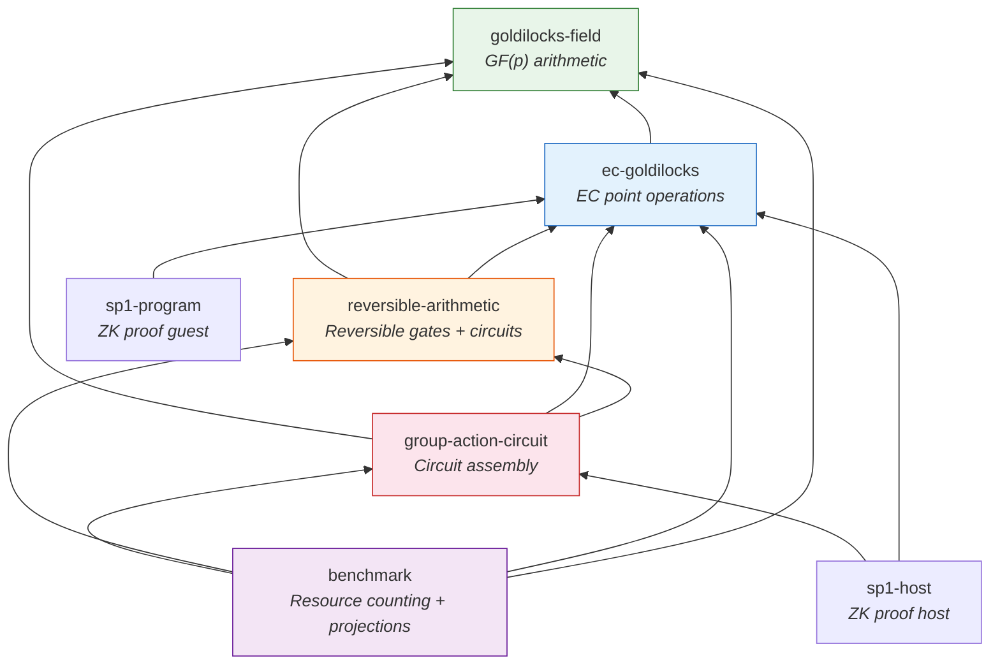
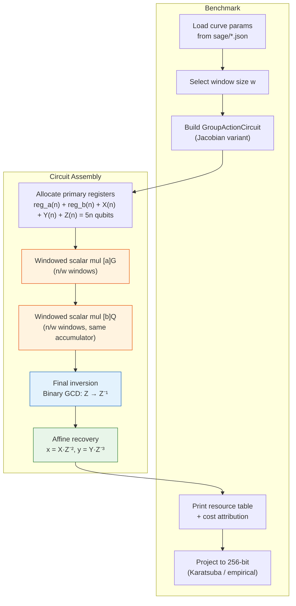
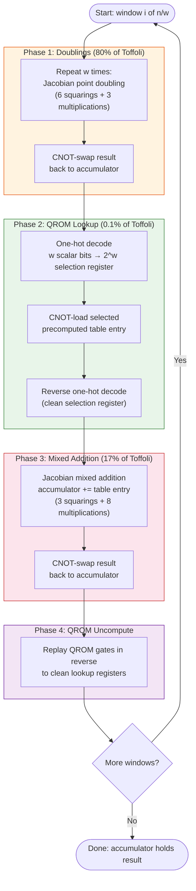
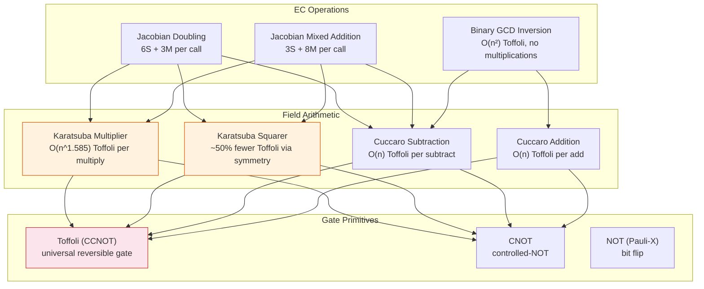
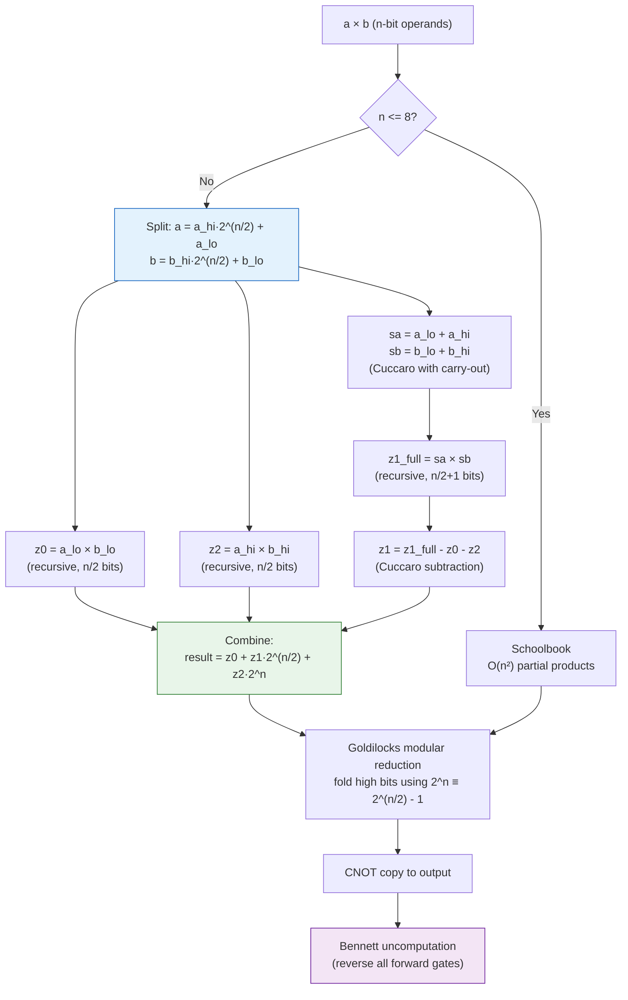
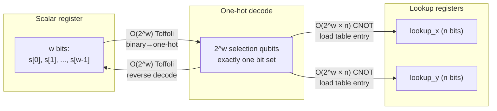
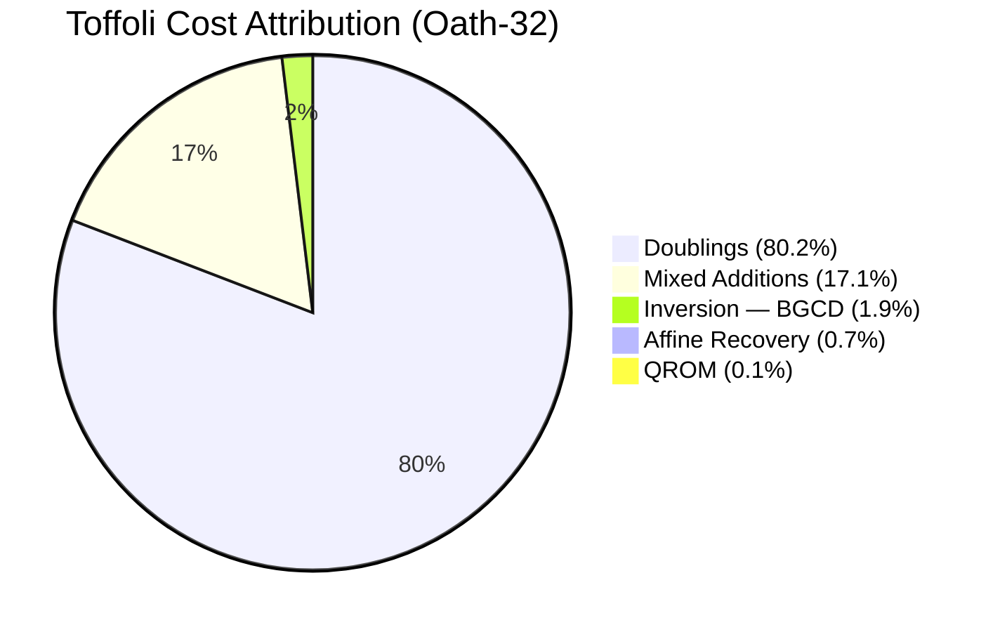
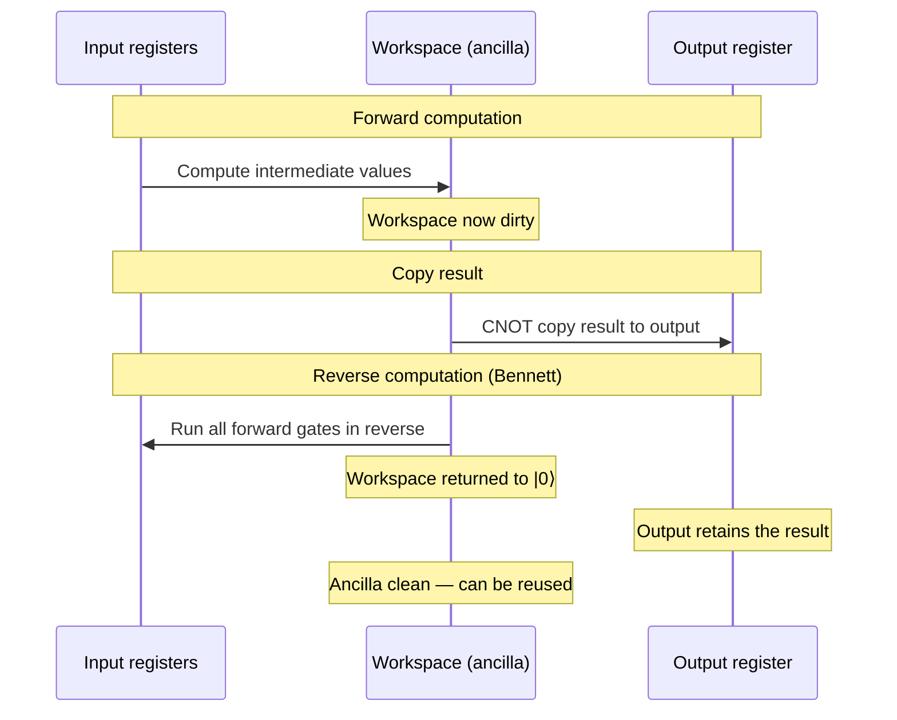
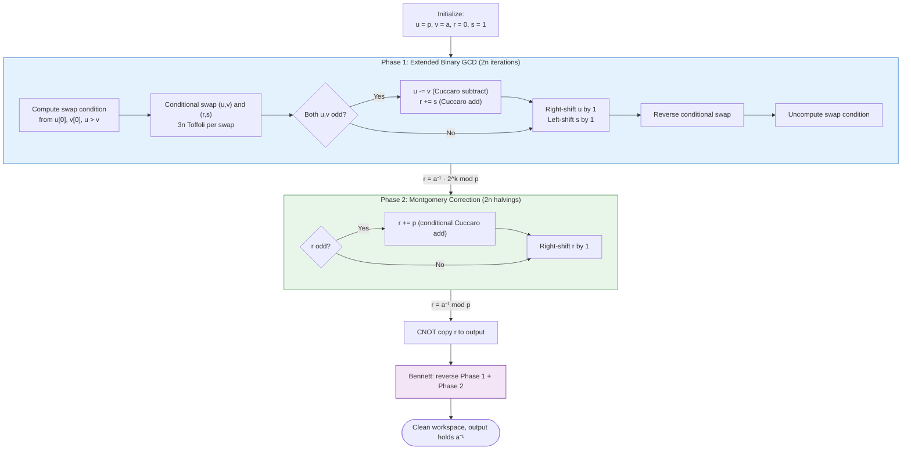
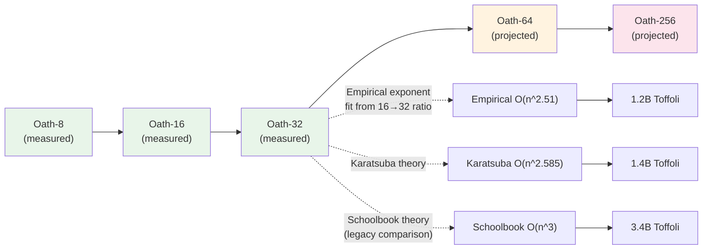

# Oathbreaker Architecture

This document describes how the Oathbreaker circuit is structured, how data
flows through the system, and where computational cost concentrates. All
diagrams use [Mermaid](https://mermaid.js.org/) syntax and render on GitHub.

---

## Crate Dependency Graph

The workspace is organized into seven crates with a strict bottom-up
dependency chain. No circular dependencies exist.



**What each crate does:**

| Crate | Role | Key types |
|-------|------|-----------|
| `goldilocks-field` | Modular arithmetic over p = 2^64 - 2^32 + 1 | `GoldilocksField` |
| `ec-goldilocks` | Classical elliptic curve operations + ECDLP solvers | `AffinePoint`, `JacobianPoint`, `CurveParams` |
| `reversible-arithmetic` | Reversible gate primitives and arithmetic circuits | `Gate`, `CuccaroAdder`, `KaratsubaMultiplier`, `BinaryGcdInverter` |
| `group-action-circuit` | Complete Shor's circuit: group-action + QFT + measurement + recovery | `ShorsEcdlp`, `GroupActionCircuit`, `Qft`, `QuantumGate` |
| `benchmark` | Measures resources, projects to 256-bit, compares to literature | `ScalingProjection`, `CostAttribution` |

---

## Circuit Construction Pipeline

Building a circuit follows a top-down assembly process. The benchmark
binary drives construction; the circuit builder wires together scalar
multiplications, an inversion, and affine recovery.



---

## Windowed Scalar Multiplication (Core Loop)

This is where >97% of the Toffoli gates are generated. Each window
iteration has four phases. The doubling phase dominates at ~80% of
total circuit cost.



---

## Arithmetic Stack

Every EC operation decomposes into field multiplications, which
decompose into gate-level primitives. The Karatsuba multiplier
sits at the center of this stack.



### Karatsuba Multiplication (Recursive Structure)

The Karatsuba multiplier recursively splits n-bit operands into halves,
performing 3 sub-multiplications instead of 4. It falls back to schoolbook
at n <= 8.



When squaring (a × a), the `is_square` flag propagates through the
recursion. At the base case, `schoolbook_integer_square` exploits
cross-term symmetry: each a[i]·a[j] pair is computed once (not twice),
saving ~50% of partial-product Toffoli.

---

## QROM One-Hot Decode

The QROM (Quantum Read-Only Memory) loads a classically precomputed
table entry into quantum registers, controlled by w scalar bits.



The decode algorithm processes scalar bits one at a time, splitting
each active selection entry into two branches (bit=0 and bit=1) via
Toffoli + CNOT pairs. After all w bits are processed, exactly one
of the 2^w one-hot qubits is set.

---

## Cost Attribution (Oath-32, w=8)

This is the measured Toffoli breakdown from the benchmark. It shows
where optimization effort should focus.



**Reading the chart:** Doublings dominate because each window iteration
performs w=8 doublings but only 1 addition. Each doubling costs
6S + 3M = 9 multiplication-equivalents; each addition costs 3S + 8M = 11.
With 8 doublings per addition, doublings account for 72/(72+11) = 87%
of the EC arithmetic, consistent with the measured 80%/17% split.

---

## Bennett's Compute-Copy-Uncompute Pattern

Every reversible subroutine in the circuit uses Bennett's pattern to
clean ancilla qubits. This is the dominant source of the ~2x gate
overhead compared to measurement-based approaches.



**Impact on cost:** Every multiplication, squaring, and inversion pays
this 2x overhead. The forward gates are collected into a `Vec<Gate>`,
the result is copied, then the same gates are replayed in reverse.
This is why measurement-based uncomputation (which avoids the reverse
pass) would roughly halve the total gate count.

---

## Binary GCD Inversion

The Binary GCD inverter replaced Fermat's method (125 multiplications)
with an O(n²) algorithm that uses only additions, subtractions, and shifts.



**Cost comparison at Oath-32 (n=32):**

| Inverter | Toffoli | Share of total circuit |
|----------|---------|----------------------|
| Fermat (old) | ~960K | ~15% |
| Binary GCD (current) | 107K | 1.9% |

---

## Scaling Projections

The benchmark reports three projection models from measured small-tier
results to 256-bit ECDLP estimates.



---

## File Map

Quick reference for navigating the codebase by concern.

```
oathbreaker/
├── crates/
│   ├── goldilocks-field/src/
│   │   ├── field.rs            # GoldilocksField: add, sub, mul, inverse, pow
│   │   └── constants.rs        # GOLDILOCKS_PRIME, P_MINUS_TWO
│   │
│   ├── ec-goldilocks/src/
│   │   ├── curve.rs            # CurveParams, AffinePoint, JacobianPoint
│   │   ├── point_ops.rs        # add, double, scalar_mul (both coord systems)
│   │   └── ecdlp.rs            # Pollard's rho, BSGS solvers
│   │
│   ├── reversible-arithmetic/src/
│   │   ├── gates.rs            # Gate enum: NOT, CNOT, Toffoli
│   │   ├── adder.rs            # CuccaroAdder (plain + modular)
│   │   ├── multiplier.rs       # Schoolbook, Karatsuba, Squarer, cuccaro_subtract
│   │   ├── inverter.rs         # FermatInverter, BinaryGcdInverter
│   │   ├── ec_add_jacobian.rs  # Reversible Jacobian mixed addition (3S+8M)
│   │   ├── ec_double_jacobian.rs # Reversible Jacobian doubling (6S+3M)
│   │   ├── ancilla.rs          # AncillaPool, UncomputeStrategy
│   │   └── resource_counter.rs # Toffoli/CNOT/NOT tracking
│   │
│   ├── group-action-circuit/src/
│   │   ├── double_scalar.rs    # GroupActionCircuit builder, CostAttribution
│   │   ├── scalar_mul_jacobian.rs # Windowed scalar mul + QROM one-hot decode
│   │   ├── precompute.rs       # Classical QROM table generation
│   │   ├── quantum_gate.rs     # Extended gate enum (Hadamard, CR, Swap, Measure)
│   │   ├── qft.rs              # QFT/inverse QFT gate generation + classical DFT sim
│   │   ├── qft_stub.rs         # QFT resource estimates (backward compat)
│   │   ├── measurement.rs      # Shor measurement outcome simulation
│   │   ├── continued_fraction.rs # CF expansion + ECDLP secret recovery
│   │   ├── shor.rs             # End-to-end Shor's ECDLP pipeline (ShorsEcdlp)
│   │   └── export.rs           # OpenQASM 3.0 export (full Shor circuit)
│   │
│   └── benchmark/src/
│       ├── main.rs             # Benchmark orchestration, window sweep
│       ├── scaling.rs          # Karatsuba/schoolbook/empirical projections
│       ├── comparison.rs       # Prior work table (Litinski, Google, etc.)
│       └── oath_tiers.rs       # Oath-8/16/32/64 tier definitions
│
├── docs/
│   ├── ARCHITECTURE.md         # This file
│   ├── CIRCUIT_ARCHITECTURE.md # Register layouts, gate decomposition
│   ├── COMPARISON.md           # Comparison to prior work
│   ├── LIMITATIONS.md          # Scope and known limitations
│   ├── BENCHMARKING.md         # Oathbreaker Scale specification
│   └── VERIFICATION.md         # Testing and verification layers
│
└── sage/                       # SageMath curve generation scripts
